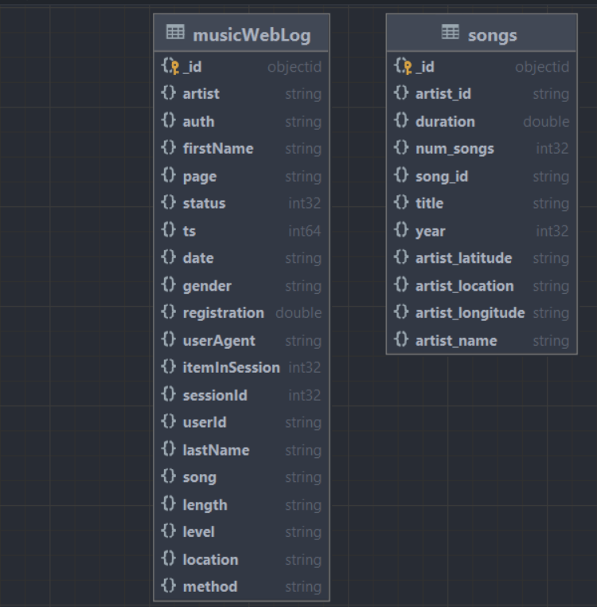
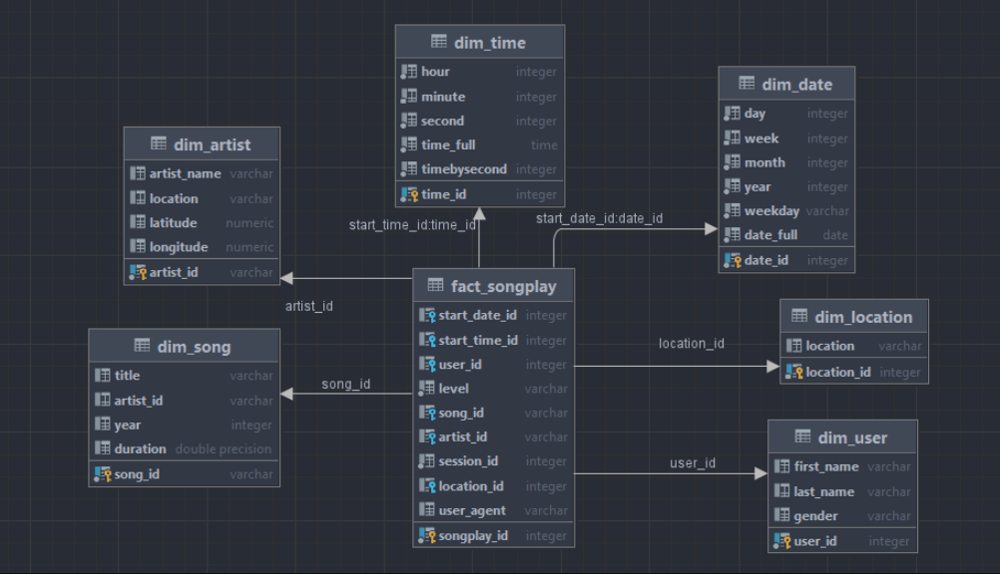

# Data-modeling-with-postgres

## **Overview**
In this project, we apply Data Modeling with PostgreSql and build an ETL pipeline using Python.
A startup wants to analyze data they've heen collecting on songs and user activity on their new music streaming app.
Data was stored in json file, after load to db, it have schema as below:



# Determine requirement:
- Know which song is played the most, by which artist, of what time
- Know which location use this app most.
- Know the songs heard by each user

# Data modeling:
Star schema:

  

# How to run
Run bash file to load data from file to local mongoDb:
```
./extract.sh
```
Run main file to execute ```createTable```, ```loadDimTable``` and ```loadFactTable```
```
python3 main.py
```
Result if run successfully:
```
Connect to postgres successfully
Drop table successfully
Create table successfully
Done load dim location
Done load dim artist
Done load dim user
Done load dim date
Done load dim time
Done load dim song
Done load fact songPlay
```